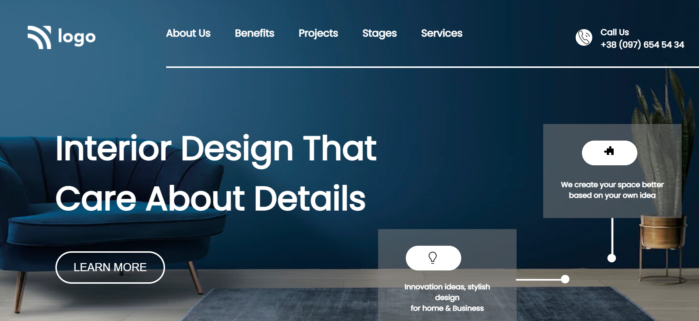

# Interior Design Landing Page

**Live-project-10**

This website is fully responsive for mobile and desktop view.

**Technologies Used:** 

1.

2.

**Learned from this project:**

1. Positions
2. Flexbox
3. Navbar
4. Media Queries

**Time Spent**

It took me around 6-7 hrs to built this webpage from scratch using HTML and CSS and making
it fully responsive for mobile and desktop view.

**Live Link**

[Live-Link](https://project10-interiordesign-landingpage.netlify.app/)

**Previews**

